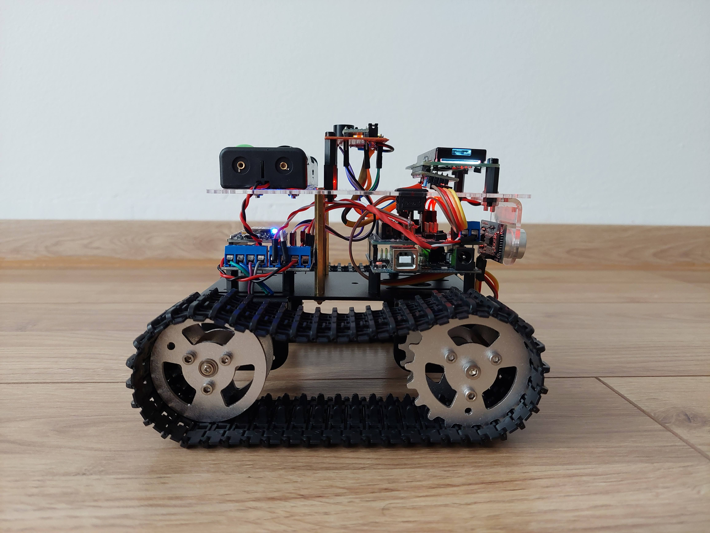
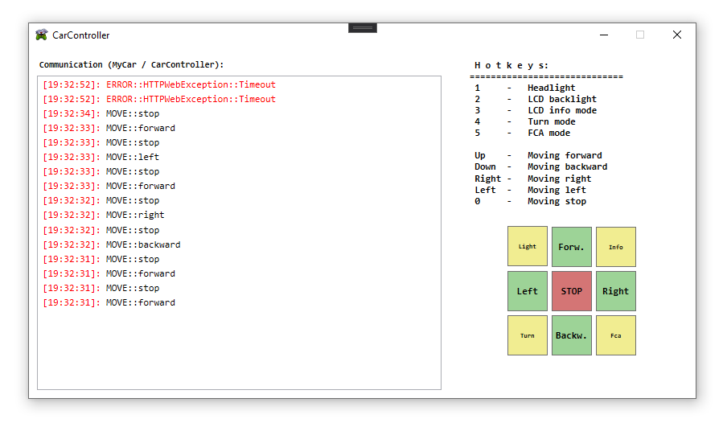
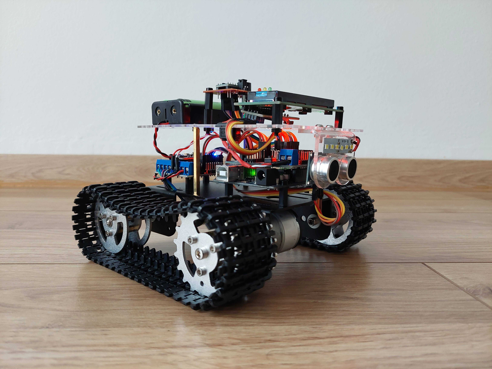
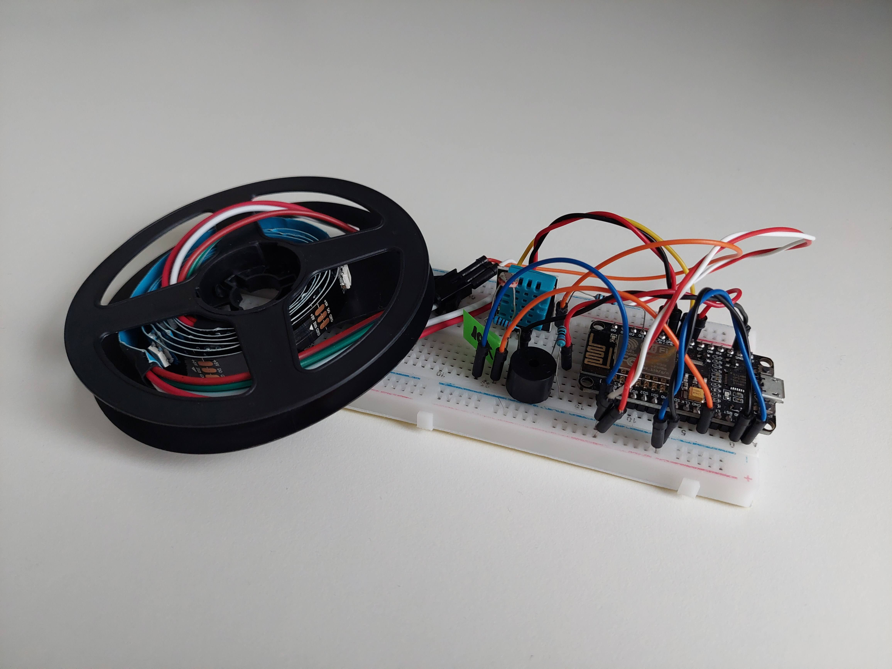
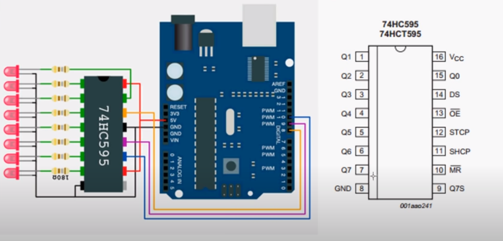

# Arduino projects

## Advanced-car-project
ESP-12E (NodeMCU) and an Arduino-UNO based car project with wifi control and many extra features like forward collision avoidance assist, LED headlight, a buzzer and some more.

    </img>
    </img>
    </img>

## NodeMCU LED-strip Controller
A NodeMcu server which controls a WS2812B LED-Strip. It also provides some additional information like the current time, temperature and humidity.

    </img>

## 74HC595N Shift register basic example
Basic 74HC595N shift register projects.

    </img>

